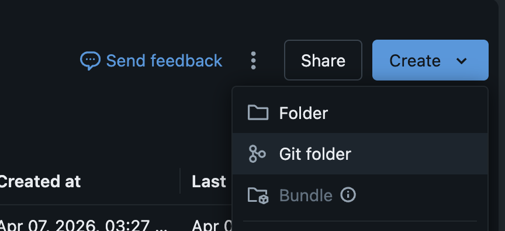
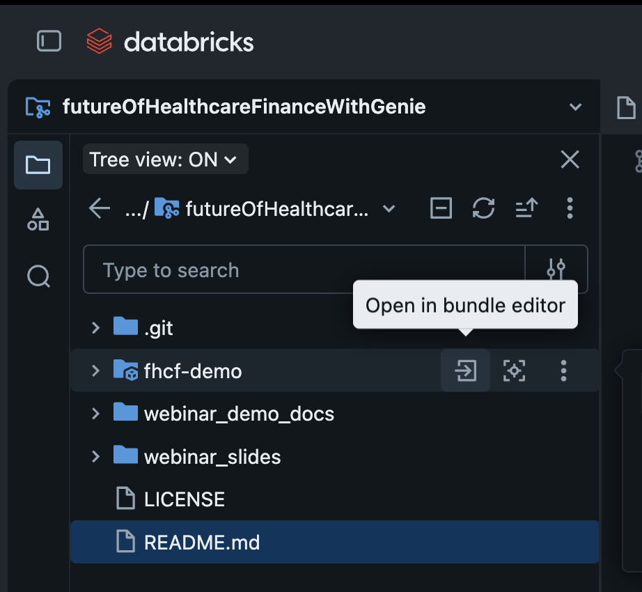

# The Future of Healthcare Finance with Genie

**Databricks HLS Quarterly Webinar — September 17, 2026**  
**Speaker:** Matt Giglia, Healthcare Field CTO, Databricks

End-to-end demo showing how a health plan CFO can use a **Genie Agent** as a data-smart AI coworker — grounded in governed metric views, semantic ontology, and synthetic healthcare finance data covering MLR trending, HEDIS quality measures, value-based care performance, and avoidable spend analytics.

---

## What's in This Repo

```
futureOfHealthcareFinanceWithGenie/
│
├── fhcf-demo/                 Declarative Automation Bundle
│                               ↳ Schema, SQL warehouse, seed + certify jobs, Genie Agent,
│                               ↳ 2 dashboards (CFO + CMO), 8 tables, 6 metric views
│                               ↳ Full reproduction guide in fhcf-demo/README.md
│
├── webinar_slides/            Presentation slide deck (Flask app, 13 slides)
│                               ↳ Run as a Databricks App or locally
│
└── webinar_demo_docs/         Design documents (L100–L300) and Mermaid diagrams
```

---

## Quick Start

### 1. Deploy the data and Genie Agent

#### Option A — Databricks Git Editor (recommended)

**Clone the repo:**

1. In the workspace sidebar, navigate to your home directory
2. Click the **Create** button and select **Git folder**
3. Paste `https://github.com/mkgs-databricks-demos/futureOfHealthcareFinanceWithGenie.git` and select `main`

> 

**Open the bundle editor:**

In the workspace sidebar, open the Git folder and find `fhcf-demo` in the tree. Hover over it — three icons appear on the right. Click the **arrow icon** (tooltip: *Open in bundle editor*) to open the bundle editor directly.

> 
> *In the Git folder tree, hover over `fhcf-demo` (note the bundle badge on the folder icon). Three action icons appear — click the arrow icon on the left (tooltip: "Open in bundle editor") to open the bundle editor.*

**Auto-configure with Genie Code:**

With the bundle editor open, click the **Genie Code** assistant panel and paste:

```
Configure and deploy this bundle to my workspace. Work through these steps in order:

STEP 1 — Gather inputs (ask before proceeding)
Ask me which UC catalog to deploy to. It must be a catalog where I have USE CATALOG
and CREATE SCHEMA permissions — the bundle creates a schema, 8 Delta tables, and
6 metric views inside it.

STEP 2 — Update databricks.yml (make these changes only)
1. Set workspace.host in both dev and prod targets to my current workspace URL
2. Set the catalog variable default to the catalog I chose
3. Remove the dev target's catalog override (targets.dev.variables.catalog) —
   schema auto-prefixing in development mode handles isolation
4. Update prod.root_path to use my workspace username (not matthew.giglia@databricks.com)
5. Update prod.run_as.user_name to my email
6. Leave all resource definitions, the schema variable, and the certify_register job unchanged

STEP 3 — Validate
Run: databricks bundle validate --target dev
Stop and show me the output if validation fails.

STEP 4 — First deploy (schema + warehouse + seed job)
Run: databricks bundle deploy --target dev

STEP 5 — Seed the data
Run: databricks bundle run seed_data --target dev
This job creates all 8 tables and 6 metric views. Wait for it to complete.

STEP 6 — Second deploy (Genie space + dashboards)
Run: databricks bundle deploy --target dev
The Genie Agent API requires tables to exist before the space can be created.

STEP 7 — Validate the narrative
Open src/seed_all_data and run cell 23. Confirm the following values hold:
- Medicaid MLR ~108%
- BCS at 72.8% and HbA1c at 58.8% (both below 4-star cutpoints)
- AHP shared savings $2.1M YTD
Report any mismatches.
```

Genie Code detects your workspace URL and email automatically, asks for the catalog before touching any files, and runs the full deploy sequence end-to-end.

#### Option B — Local CLI

```bash
git clone https://github.com/mkgs-databricks-demos/futureOfHealthcareFinanceWithGenie.git
cd futureOfHealthcareFinanceWithGenie/fhcf-demo
# Edit databricks.yml: set workspace.host, catalog, and prod run_as to your values
databricks bundle deploy --target dev          # Creates schema + warehouse + job
databricks bundle run seed_data --target dev   # Seeds 8 tables + 6 metric views
databricks bundle deploy --target dev          # Creates Genie space + dashboards (tables must exist first)
```

See **[fhcf-demo/README.md](fhcf-demo/README.md)** for the complete step-by-step guide, including variable configuration, production deployment, certification, validation, ontology setup, and customization.

### 2. Run the slide deck

```bash
cd webinar_slides
pip install -r requirements.txt
python app.py
# Open http://localhost:8000
```

Or deploy as a **Databricks App** by pointing to the `webinar_slides/` directory. Press **F** for fullscreen, **←/→** to navigate, **G** for grid overview.

---

## The Demo

The webinar follows a three-act structure:

**Act 1 — The Problem** (Slides 1–4c): Industry trends, silo pain, regulatory forcing functions (underwriting, NAIC AI, Rx rebates).

**Act 2 — The Solution** (Slides 5–7): Risk adjustment modernization (SAS → Python), unified data vision, transition to live demo.

**Act 3 — The Live Demo** (4 Beats, 8 Prompts):

| Beat | Prompt | What It Shows |
| --- | --- | --- |
| 1a | Morning briefing — flag off-track items | Genie as a scheduled intelligence agent |
| 1b | HEDIS measures below 4-star cutpoints | Drill-down into quality via governed metric views |
| 2a | Top 10 highest-risk members | Member-level detail with risk scores and care gaps |
| 2b | High-risk members in high avoidable ED states | Cross-referencing members with utilization patterns |
| 3a | Calendar integration (MCP connector) | Genie accessing external tools |
| 3b | AHP value-based care overview | ACO performance with synonym resolution |
| 3c | TCOC drill-down — is it pharmacy? | Root cause analysis (GLP-1 cost pressure) |
| 3d | Prepare a brief for Dr. Chen meeting | Synthesized meeting brief from live data |

**Act 4 — The Close** (Slides 9–10): Customer proof points (HSS, Humana, Premier) and sourced references.

---

## Planted Narrative

The synthetic data encodes a deterministic story verified by validation queries:

* Medicaid MLR ~108% (off track), MA ~101% (borderline), Commercial ~87% (healthy)
* FL, TX, CA: 2x avoidable ED rate vs other states
* BCS at 72.8% and HbA1c at 58.8% — both below 4-star cutpoints
* AHP shared savings $2.1M YTD vs $1.8M target; pharmacy PMPM +8% QoQ from GLP-1

---

## What Gets Created

| Layer | Objects |
| --- | --- |
| Tables (8) | dim_aco_contract, dim_budget, dim_member, dim_provider_network, gold_financial_monthly, gold_quality_measures, gold_utilization_monthly, fact_vbc_performance |
| Metric Views (6) | mv_financial, mv_quality, mv_vbc_performance, mv_utilization, mv_budget_variance, mv_member_risk |
| SQL Warehouse | [FHCF] Healthcare Finance Warehouse — 2X-Small serverless PRO, auto-stop 10 min |
| Genie Agent | Healthcare Finance Intelligence — 14 data sources, 7 sample questions, 12 behavioral rules |
| Dashboards (2) | CFO Executive Dashboard (5 pages, 15 datasets) + Health Plan CMO Performance Dashboard (12 pages, 9 datasets) — all KPIs via governed metric views with MEASURE() |
| Jobs (2) | Seed Healthcare Finance Data + Certify & Register Domain Assets (prod-only, condition_task DAG) |
| Ontology | 18 UC Pages across Financial, Quality, VBC, and Organizational subdomains |
| Slides | 13 HTML slides with presenter console and speaker notes |

---

## Design Documents

The `webinar_demo_docs/docs/design/` directory contains the full specification:

| Level | Document | Content |
| --- | --- | --- |
| L100 | System Constitution | Overview, data model, demo beats, deploy order |
| L200 | Bundle 1 (Data Foundation) | Table schemas, seed data design |
| L200 | Bundle 2 (AI/BI Experience) | Genie Agent design, benchmark prompts |
| L200 | Glossary Pages | 18 UC Page definitions across 4 subdomains |
| L300-A | Table Schemas and Data | Column-level DDL specifications |
| L300-B | Metric View Definitions | Metric view YAML and SQL definitions |
| L300-C | Genie Agent Instructions | Complete instruction set and behavioral rules |
| L300-D | Seed Data SQL | INSERT statement templates with narrative values |

---

## Customizing

The bundle is designed to be portable. Use the **Genie Code** prompt in [Quick Start](#quick-start) to auto-configure for your workspace, or edit `fhcf-demo/databricks.yml` manually:

```yaml
variables:
  catalog:
    default: your_catalog
  schema:
    default: your_schema
# warehouse is a managed bundle resource — no variable needed
```

All Genie space and dashboard references use `${resources.schemas.*}` and `${resources.sql_warehouses.*}` interpolation and resolve automatically per target. See **[fhcf-demo/README.md](fhcf-demo/README.md)** for details on modifying the narrative, Genie instructions, slides, and ontology.

---

## References

* [Declarative Automation Bundles](https://docs.databricks.com/aws/en/dev-tools/bundles/workspace-bundles)
* [Declarative Automation Bundles configuration reference](https://docs.databricks.com/aws/en/dev-tools/bundles/reference)
* [Metric Views](https://docs.databricks.com/en/sql/language-manual/sql-ref-metric-views.html)
* [Genie Spaces](https://docs.databricks.com/en/genie/index.html)
* [Unity Catalog Pages](https://docs.databricks.com/en/discover/pages.html)

---

## License

See [LICENSE](LICENSE).
