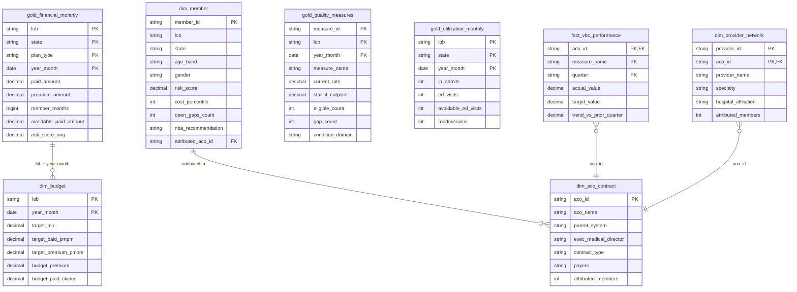

# Data Model — Entity Relationship

```mermaid
erDiagram
    gold_financial_monthly {
        string lob PK
        string state PK
        string plan_type PK
        date year_month PK
        decimal paid_amount
        decimal premium_amount
        bigint member_months
        decimal avoidable_paid_amount
        decimal risk_score_avg
    }

    dim_budget {
        string lob PK
        date year_month PK
        decimal target_mlr
        decimal target_paid_pmpm
        decimal target_premium_pmpm
        decimal budget_premium
        decimal budget_paid_claims
    }

    dim_member {
        string member_id PK
        string lob
        string state
        string age_band
        string gender
        decimal risk_score
        int cost_percentile
        int open_gaps_count
        string nba_recommendation
        string attributed_aco_id FK
    }

    gold_quality_measures {
        string measure_id PK
        string lob PK
        date year_month PK
        string measure_name
        decimal current_rate
        decimal star_4_cutpoint
        int eligible_count
        int gap_count
        string condition_domain
    }

    gold_utilization_monthly {
        string lob PK
        string state PK
        date year_month PK
        int ip_admits
        int ed_visits
        int avoidable_ed_visits
        int readmissions
    }

    fact_vbc_performance {
        string aco_id PK,FK
        string measure_name PK
        string quarter PK
        decimal actual_value
        decimal target_value
        decimal trend_vs_prior_quarter
    }

    dim_aco_contract {
        string aco_id PK
        string aco_name
        string parent_system
        string exec_medical_director
        string contract_type
        string payers
        int attributed_members
    }

    dim_provider_network {
        string provider_id PK
        string aco_id PK,FK
        string provider_name
        string specialty
        string hospital_affiliation
        int attributed_members
    }

    dim_member ||--o{ dim_aco_contract : "attributed to"
    fact_vbc_performance }o--|| dim_aco_contract : "aco_id"
    dim_provider_network }o--|| dim_aco_contract : "aco_id"
    gold_financial_monthly ||--o{ dim_budget : "lob + year_month"
```
