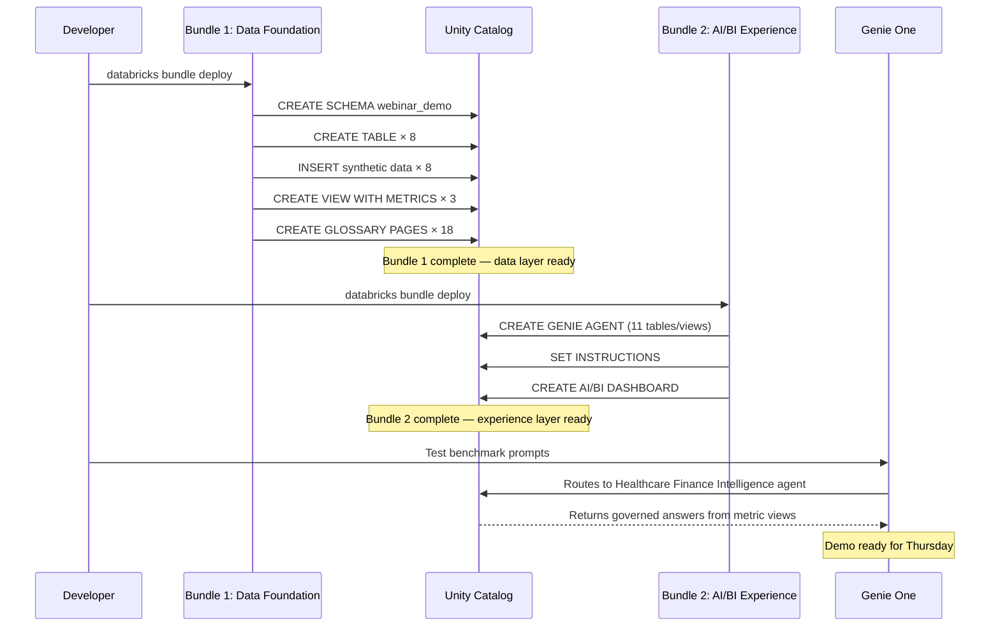

# Bundle Deployment Sequence

```mermaid
sequenceDiagram
    participant Dev as Developer
    participant B1 as Bundle 1: Data Foundation
    participant UC as Unity Catalog
    participant B2 as Bundle 2: AI/BI Experience
    participant G1 as Genie One

    Dev->>B1: databricks bundle deploy
    B1->>UC: CREATE SCHEMA webinar_demo
    B1->>UC: CREATE TABLE × 8
    B1->>UC: INSERT synthetic data × 8
    B1->>UC: CREATE VIEW WITH METRICS × 3
    B1->>UC: CREATE GLOSSARY PAGES × 18
    Note over UC: Bundle 1 complete — data layer ready

    Dev->>B2: databricks bundle deploy
    B2->>UC: CREATE GENIE AGENT (11 tables/views)
    B2->>UC: SET INSTRUCTIONS
    B2->>UC: CREATE AI/BI DASHBOARD
    Note over UC: Bundle 2 complete — experience layer ready

    Dev->>G1: Test benchmark prompts
    G1->>UC: Routes to Healthcare Finance Intelligence agent
    UC-->>G1: Returns governed answers from metric views
    Note over G1: Demo ready for Thursday
```
